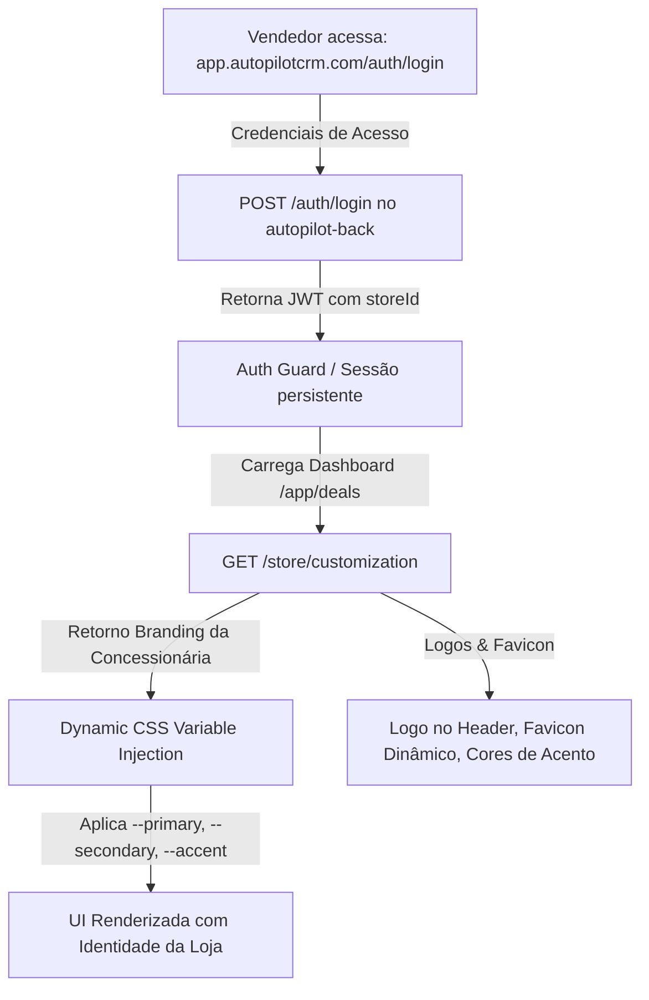

# 📋 Planejamento de Implementação Frontend: Boilerplate CRM White-Label + AutoPilot IA

> **Projeto**: AutoPilot CRM (Frontend Boilerplate Multi-Tenant)
> **Repositório**: `autopilot-front`
> **Framework**: Next.js 14 (App Router) + Tailwind CSS + Radix UI + Redux Toolkit + Socket.io Client
> **Backend Principal Relacionado**: `autopilot-backend` (NestJS + Prisma + PostgreSQL + Redis + Socket.io)
> **Domínio Único**: `app.autopilotcrm.com` (Sem subdomínios: login único e injeção dinâmica de branding pós-autenticação)
> **Decisões Alinhadas**:
>
> - **Código e APIs em Inglês ("Deal"), UI em Português**: Nomes de variáveis, DTOs, modelos, serviços e rotas em inglês; labels e textos da tela em português para o time comercial das concessionárias.
> - **Rotas do Navegador em Inglês**: `/app/deals`, `/app/deals/chat`, `/app/customers`, `/app/settings`, etc.
> - **Comunicação em Tempo Real**: Socket.io Client (`socket.client.ts`) conectado ao WebSocket Gateway do `autopilot-backend` para entrega instantânea de mensagens e atualização do AutoPilot IA (eliminando o polling).
> - **White-Label Dinâmico em Domínio Único**: Ao efetuar o login, o frontend obtém os dados visuais da concessionária via `GET /store/customization` e injeta as CSS variables dinamicamente no tema.

---

## 🏗️ 1. Arquitetura Multi-Tenant & White-Label no Frontend (Domínio Único)

Todo o acesso ocorre por um **único domínio** (ex: `app.autopilotcrm.com`), eliminando a necessidade de DNS Wildcard e certificados SSL por subdomínio.



### 1.1 Injeção Dinâmica de CSS Variables (Theming Engine)

- As variáveis HSL do `globals.css` (`--primary`, `--secondary`, `--accent`, `--ring`) são sobrescritas no elemento `:root` em tempo de execução via inline `<style>` ou hook `useTenantTheme`.
- O Tailwind CSS continuará lendo `hsl(var(--primary))`, permitindo que botões, badges, hovers e gráficos adaptem suas cores dinamicamente à marca da loja.

---

## 🌐 2. Fase 1: Internacionalização e Padronização do Código (Português ➔ Inglês)

_Objetivo: Migrar toda a base de código frontend (tipos, chamadas de API, nomenclatura de rotas e modelos) para o padrão internacional em inglês baseado em **`Deal`**._

### 2.1 Reestruturação das Rotas do Next.js App Router (`src/app/app/`)

| Rota Atual (PT)                 | Nova Rota (EN)           | Finalidade                              |
| :------------------------------ | :----------------------- | :-------------------------------------- |
| `src/app/app/dashboard`         | `src/app/app/dashboard`  | Dashboard e métricas principais         |
| `src/app/app/atendimentos`      | `src/app/app/deals`      | Kanban e listagem de negociações        |
| `src/app/app/atendimentos/chat` | `src/app/app/deals/chat` | Central de conversas (com AutoPilot IA) |
| `src/app/app/clientes`          | `src/app/app/customers`  | Gestão de clientes e histórico          |
| `src/app/app/configuracoes`     | `src/app/app/settings`   | Configurações gerais e canais           |
| `src/app/app/painel-relatorio`  | `src/app/app/reports`    | Relatórios gerenciais e por canal       |
| `src/app/app/ajuda-e-faq`       | `src/app/app/help-faq`   | Central de ajuda                        |
| `src/app/autenticacao`          | `src/app/auth`           | Login, recuperação de senha             |
| `src/app/app/assinaturas`       | _(Remover)_              | Eliminado na sanitização                |

### 2.2 De-Para de Modelos e Tipos (`src/types/`)

| Modelo Atual (PT)               | Novo Modelo (EN)           | Arquivo de Destino                |
| :------------------------------ | :------------------------- | :-------------------------------- |
| `Usuario` / `Login`             | `User` / `AuthCredentials` | `src/types/auth.ts`               |
| `Loja` / `StoreCustomization`   | `Store` / `TenantConfig`   | `src/types/store.ts`              |
| `Colaborador`                   | `Employee`                 | `src/types/employee.ts`           |
| `Cargo`                         | `Role`                     | `src/types/role.ts`               |
| `Cliente`                       | `Customer`                 | `src/types/customer.ts`           |
| `ClienteTemporario`             | `TemporaryCustomer`        | `src/types/temporary-customer.ts` |
| `Atendimento`                   | **`Deal`**                 | `src/types/deal.ts`               |
| `Visita` / `VisitasAtendimento` | **`DealVisit`**            | `src/types/visit.ts`              |
| `Tarefa` / `TarefasAtendimento` | **`DealTask`**             | `src/types/task.ts`               |
| `Comentario`                    | **`DealComment`**          | `src/types/comment.ts`            |
| `Chat` / `ChatEmLista`          | `Chat` / `ChatListItem`    | `src/types/chat.ts`               |
| `Mensagem`                      | `Message`                  | `src/types/message.ts`            |
| `MensagemPadrao`                | `MessageTemplate`          | `src/types/message-template.ts`   |
| `Tag`                           | `Tag`                      | `src/types/tag.ts`                |

### 2.3 Refatoração Modular da Camada de Serviços (`src/services/`)

Decomposição do arquivo monolítico `src/lib/api-app.ts` (>3.000 linhas) em serviços desacoplados e tipados:

```
src/services/
├── api.client.ts              # Axios singleton com interceptors de JWT e error handling
├── socket.client.ts           # Socket.io Client para eventos em tempo real do autopilot-back
├── auth.service.ts            # login, recuperação e reset; sessão sem refresh no contrato atual
├── tenant.service.ts          # getStoreCustomization, updateCustomization
├── chat.service.ts            # getChats, getMessages, sendMessage, markAsRead
├── copilot.service.ts         # getCopilotAnalysis, refreshAnalysis
├── deal.service.ts            # getDeals, getDealById, createDeal, updateStatus, tasks, visits, comments
├── customer.service.ts        # getCustomers, createCustomer, updateCustomer
├── employee.service.ts        # getEmployees, createEmployee, updateRole
├── integration.service.ts     # getStatus, connectWhatsApp (QR code), disconnectWhatsApp
└── reports.service.ts         # getGeneralReport, getDealsByChannel, getSellerMetrics
```

### 2.4 Padronização dos Endpoints Consumidos (Totalmente Alinhados com `autopilot-backend`)

- **Deals**:
  - `POST /deals`: Criar negociação
  - `GET /deals`: Listar negociações (Kanban/Tabela)
  - `GET /deals/:id`: Detalhes da negociação
  - `PATCH /deals/:id/status`: Mudar etapa do funil
- **Chats & Mensagens**:
  - `GET /chats`: Listar conversas
  - `GET /chats/:chatId/messages`: Histórico de mensagens
  - `POST /chats/:chatId/messages`: Enviar mensagem comercial
  - `PATCH /chats/:chatId/read`: Marcar mensagens como lidas
- **AutoPilot IA**:
  - `GET /chats/:chatId/copilot`: Obter dossiê e sugestões consolidadas
  - `POST /chats/:chatId/copilot/refresh`: Solicitar reanálise forçada à IA
- **Integrações (WhatsApp)**:
  - `GET /integrations/status`: Status unificado das conexões
  - `POST /integrations/whatsapp/connect`: Iniciar sessão e receber QR Code
  - `DELETE /integrations/whatsapp`: Desconectar WhatsApp
- **Branding / Customização da Concessionária**:
  - `GET /store/customization`: Obter cores e logos da loja autenticada

---

## 🧹 3. Fase 2: Limpeza, Sanitização e Desacoplamento (Remoção Stripe)

_Objetivo: Remover todo resquício de checkout e assinaturas para transformar o produto em um SaaS B2B limpo para concessionárias._

### 3.1 Remoção de Dependências e Arquivos Legados

- [x] Desinstalar pacotes no `package.json`:
  ```bash
  npm uninstall @stripe/react-stripe-js @stripe/stripe-js
  ```
- [x] Excluir diretório `src/components/stripe/`.
- [x] Excluir rota `src/app/app/assinaturas/`.
- [x] Remover tela de planos legados em `src/app/backoffice/app/planos/`.
- [x] Converter `src/app/backoffice/app/assinantes/` em um painel corporativo de **Gestão de Concessionárias / Tenants** (sem cobrança Stripe).
- [x] Remover links de "Assinatura" da Sidebar (`src/components/nav/sidebar.tsx`) e menus mobile.

### 3.2 Remoção de Bloqueios e Guards de Assinatura

- [x] Limpar `whatsapp-integracao.tsx`: eliminar verificação `needsSubscription` e erros de "assinatura ativa".
- [x] Limpar telas de integração (Instagram, Facebook, OLX) de qualquer bloqueio condicional a planos.
- [x] Remover chamadas legadas de pagamento do `api-app.ts` / camada de serviços.

---

## 🎨 4. Fase 3: White-Label Dinâmico pós-Login

_Objetivo: Suportar total personalização de marca por concessionária dentro do domínio único._

### 4.1 Contexto Global de Concessionária (`src/contexts/TenantContext.tsx`)

- Após login bem-sucedido, carrega o perfil da loja:
  - `primaryColor`, `secondaryColor`, `accentColor`
  - `logoLightUrl`, `logoDarkUrl`, `faviconUrl`
  - Horários de atendimento e regras da loja
- Aplica dinamicamente as variáveis CSS no `:root`:
  ```css
  :root {
    --primary: <cor_primaria_concessionaria_hsl>;
    --secondary: <cor_secundaria_concessionaria_hsl>;
    --accent: <cor_acento_concessionaria_hsl>;
  }
  ```

### 4.2 Painel de Identidade Visual (`src/app/app/settings/branding`)

- Interface intuitiva para administradores da concessionária:
  - Upload do logo principal e URLs HTTPS para logos em fundo claro/escuro.
  - URL HTTPS do Favicon (o backend atual não possui upload dedicado).
  - Seletor de Cores (ColorPicker) para Cor Primária, Secundária e Destaque.
  - Configuração de horários de funcionamento da loja.
  - Pré-visualização instantânea (Live Preview) do tema antes de salvar.

---

## 📱 5. Fase 4: Integração com WhatsApp Robusto e WebSockets

_Objetivo: Proporcionar interface reativa e estável para a conexão do WhatsApp via `autopilot-backend` (que delega ao gateway `autopilot-micro`)._

### 5.1 Interface de Conexão WhatsApp (`src/components/sections/settings/integrations/WhatsappEvolutionCard.tsx`)

- [x] **Fluxo de Conexão**:
  1. **Solicitação**: Chama `POST /integrations/whatsapp/connect` no backend principal.
  2. **QR Code**: Renderiza o QR Code retornado com cronômetro visual de renovação.
  3. **Status Conectado**:
     - Badge verde de status ativo (`CONNECTED` / `OPEN`).
     - Exibição do número comercial conectado.
     - Botão de "Desconectar Sessão" (`DELETE /integrations/whatsapp`).

### 5.2 Comunicação em Tempo Real via Socket.io (`socket.client.ts`)

- [x] Adicionar dependência: `npm install socket.io-client`
- [x] Conectar ao WebSocket Gateway do `autopilot-backend`:
  - `message:received`: Adiciona novas mensagens à lista ativa instantaneamente, sem nenhum polling.
  - `message:status`: Atualiza o tick de leitura/entrega da mensagem.
  - `autopilot:analysis-ready`: Atualiza automaticamente o dossiê da negociação e as sugestões táticas da IA.

---

## 🧠 6. Fase 5: Módulo AutoPilot IA no Frontend (Dossiê & Respostas 1-Click)

_Objetivo: Transformar o chat em uma central de inteligência para o vendedor, garantindo velocidade máxima com total controle humano._

### 6.1 Dossiê Estratégico do Lead (Raio-X da Negociação)

Painel lateral retrátil integrado ao chat (`src/components/sections/chat/copilot/LeadDossierPanel.tsx`):

- 🚗 **Veículo de Interesse**: Modelo, versão, ano e valor do anúncio.
- 🔄 **Veículo de Troca**: Identificação de carro oferecido na troca (ano, versão, km).
- 💰 **Condição de Pagamento**: Financiamento pretendido, valor de entrada ou à vista.
- 🌡️ **Temperatura do Lead**: Termômetro visual dinâmico (Frio ❄️ / Morno 🌤️ / Quente 🔥).
- ⚠️ **Principal Objeção Detectada**: Destaque para hesitações do cliente (ex: juros, avaliação do usado).
- 🎯 **Próxima Melhor Ação (Next Best Action)**: Recomendação tática direta para o vendedor avançar o funil.
- ✍️ **Ações de CRM 1-Click (Controle Humano)**:
  - Botão _"Aplicar ao Deal"_: transfere os dados detectados para a ficha da negociação, sem alterar nada sem o clique do vendedor.

### 6.2 Sugestões de Resposta Rápida (1-Click Quick Replies)

Barra fixa posicionada diretamente acima do campo de digitação (`src/components/sections/chat/copilot/CopilotQuickReplies.tsx`):

- Chips interativos horizontais com sugestões táticas geradas pela LLM.
- **Mecânica 1-Click com Controle Humano**:
  - O vendedor clica na sugestão desejada.
  - O texto é inserido no campo de texto de digitação.
  - O vendedor pode ler, ajustar, adicionar detalhes pessoais e clicar em Enviar.
- **Botão de Refresh**:
  - Permite solicitar novas sugestões instantaneamente via `POST /chats/:chatId/copilot/refresh`.

---

## 📋 7. Cronograma de Execução e Checklist de Tarefas

### Etapa 1: Sanitização e Limpeza

- [x] Remover `@stripe/react-stripe-js` e `@stripe/stripe-js` do `package.json`.
- [x] Excluir rotas de assinaturas e componentes do Stripe.
- [x] Remover checagens de `needsSubscription` nas integrações.
- [x] Atualizar `name` no `package.json` para `autopilot-front`.
- [x] Validar build (`npm run build`) sem erros de dependências ausentes.

### Etapa 2: White-Label Dinâmico pós-Login

- [x] Criar `TenantContext` e hook `useTenant` para carregar branding pós-autenticação.
- [x] Implementar injeção de CSS variables para Tailwind no layout raiz autenticado.
- [x] Atualizar a página de login para a identidade institucional do AutoPilot CRM.
- [x] Criar tela de configurações de identidade visual da concessionária (`/app/settings/branding`).

### Etapa 3: Migração de Nomenclatura, Rotas e Camada de Serviços

- [x] Renomear pastas de rotas para inglês (`/app/deals`, `/app/customers`, `/app/settings`, etc.).
- [x] Criar interfaces e tipos em inglês em `src/types/` (`Deal`, `DealTask`, `DealVisit`).
- [x] Decompor `src/lib/api-app.ts` nos serviços modulares em `src/services/`.
- [x] Atualizar chamadas dos componentes para os novos serviços e endpoints REST padronizados.

### Etapa 4: WebSockets & Integração WhatsApp

- [x] Instalar `socket.io-client` e configurar conexão em `socket.client.ts`.
- [x] Substituir o `setInterval` de 3 segundos por escuta de eventos do socket.
- [x] Criar componente de conexão com QR Code moderno consumindo `POST /integrations/whatsapp/connect`.

### Etapa 5: Módulo AutoPilot IA no Chat

- [x] Implementar `copilot.service.ts` com endpoints consolidados.
- [x] Criar componente `LeadDossierPanel` na tela de chat.
- [x] Criar componente `CopilotQuickReplies` acima da caixa de mensagem com preenchimento 1-click.
- [x] Integrar evento `autopilot:analysis-ready` para atualizar dossiê e respostas sem recarregar a página.

## Registro de implementação

As etapas de frontend foram implementadas usando `autopilot-backend` como referência. As decisões posteriores do produto prevalecem sobre o rascunho: cadastro pelo backoffice, sessão persistente, WhatsApp Evolution, identidade padrão própria e revisão humana da IA. Não há modo demonstrativo.

O upload dedicado de favicon e a exposição permanente do número WhatsApp dependem de endpoints/campos que o backend atual não oferece. Os demais campos do dossiê são persistidos na descrição do deal até existir um contrato estruturado. A restrição do cadastro também precisa ser aplicada à API: proposta de patch e roteiro de validação em [docs/BACKEND_ALIGNMENT.md](docs/BACKEND_ALIGNMENT.md).

Os checks acima representam a implementação do frontend; o teste integrado com backend/microservice permanece pendente de subir esses serviços.
