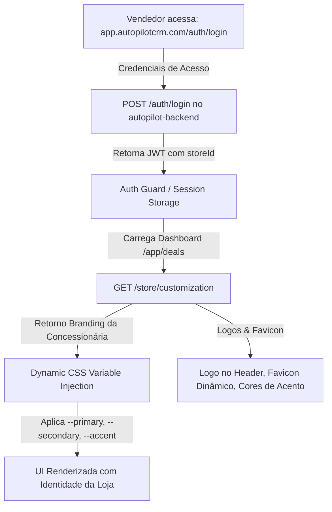

# AutoPilot CRM - Frontend (Web App Multi-Tenant White-Label)

> **Projeto**: Boilerplate CRM White-Label + AutoPilot IA (Frontend)  
> **Repositório**: `autopilot-frontend`  
> **Framework**: Next.js 14 (App Router) + Tailwind CSS + Radix UI + Redux Toolkit + Socket.io Client  
> **Backend Principal Relacionado**: `autopilot-backend` (NestJS + Prisma + PostgreSQL + Redis + Socket.io)  
> **Domínio Único**: `app.autopilotcrm.com` (Sem subdomínios: login único e injeção dinâmica de branding pós-autenticação)  
> **Padrão de Linguagem**: Código e APIs em Inglês ("Deal"), UI e labels em Português para o time comercial.

Aplicação web principal do AutoPilot CRM, interface de usuário tanto para lojistas/colaboradores quanto para o backoffice administrativo. Construída com Next.js 14, React 18, Tailwind CSS e componentes shadcn/ui.

---

## 🏗️ Principais Pilares Arquiteturais

1. **Código e APIs em Inglês ("Deal"), UI em Português** — Nomes de variáveis, DTOs, modelos, serviços e rotas em inglês; labels e textos da tela em português para o time comercial das concessionárias.
2. **Rotas do Navegador em Inglês** — `/app/deals`, `/app/deals/chat`, `/app/customers`, `/app/settings`, etc.
3. **Comunicação em Tempo Real** — Socket.io Client (`socket.client.ts`) conectado ao WebSocket Gateway do `autopilot-backend` para entrega instantânea de mensagens e atualização do AutoPilot IA (eliminando polling).
4. **White-Label Dinâmico em Domínio Único** — Ao efetuar o login, o frontend obtém os dados visuais da concessionária via `GET /store/customization` e injeta as CSS variables dinamicamente no tema.
5. **Módulo AutoPilot IA no Chat** — Dossiê Estratégico do Lead (Raio-X da Negociação) + Sugestões de Resposta Rápida (1-Click Quick Replies) com **controle 100% humano**.
6. **Limpeza e Sanitização** — Remoção total de Stripe, planos e assinaturas (SaaS B2B puro, sem bloqueios de cobrança).

---

## 🌐 Arquitetura Multi-Tenant & White-Label (Domínio Único)

Todo o acesso ocorre por um **único domínio** (ex: `app.autopilotcrm.com`), eliminando a necessidade de DNS Wildcard e certificados SSL por subdomínio.



### Injeção Dinâmica de CSS Variables (Theming Engine)
- As variáveis HSL do `globals.css` (`--primary`, `--secondary`, `--accent`, `--ring`) são sobrescritas no elemento `:root` em tempo de execução via hook `useTenantTheme`.
- O Tailwind CSS continua lendo `hsl(var(--primary))`, permitindo que botões, badges, hovers e gráficos adaptem suas cores dinamicamente à marca da loja.

---

## 📋 Funcionalidades Principais

### Painel da Loja (Lojistas/Colaboradores)
- **Dashboard** — Visão geral da loja, métricas de deals, origem de leads, últimos deals.
- **Deals (Negociações)** — Kanban de deals (funil de vendas), chat em tempo real com leads/clientes, gerenciamento de tarefas, visitas, comentários e activity logs.
- **Central de Conversas** — Chat integrado ao AutoPilot IA com:
  - Painel lateral **Dossiê Estratégico do Lead**: veículo de interesse, troca, método de pagamento, temperatura, objeção principal, Next Best Action.
  - Barra **Quick Replies 1-Click**: sugestões táticas da IA inseridas no campo de digitação para o vendedor revisar e enviar.
- **Customers** — Listagem e detalhes completos, histórico do cliente, qualificação.
- **Reports** — Relatório geral de deals e vendas, por canal de atendimento, por vendedor (desempenho, métricas avançadas, motivos de perdas), tempo médio de resposta, conversão por temperatura do lead.
- **Settings** — Dados da loja, identidade visual (branding com Live Preview), integrações (WhatsApp, Instagram, Facebook, OLX, etc.), permissões e acessos de usuários.
- **Help & FAQ** — FAQ, tickets de suporte, abertura de novos tickets.

### Backoffice Administrativo
- **Dashboard** — Estatísticas gerais (concessionárias cadastradas, uso do sistema).
- **Gestão de Concessionárias / Tenants** — Listagem e gestão de lojas cadastradas.
- **FAQ** — Publicação e gestão de posts do FAQ.
- **Acessos** — Gestão de usuários admin, permissões.
- **Tickets** — Atendimento de tickets de suporte das lojas.

### Autenticação
- Login/cadastro de lojistas.
- Login/cadastro de usuários backoffice.
- Recuperação e redefinição de senha.
- Confirmação de email.

---

## 🛠️ Stack Tecnológica

| Categoria | Tecnologia |
| :--- | :--- |
| **Framework** | Next.js 14 (App Router) + React 18 |
| **Linguagem** | TypeScript 5 |
| **Estilização** | Tailwind CSS 3, Tailwind Merge, clsx, CVA |
| **Componentes UI** | shadcn/ui (Radix UI primitives), Lucide Icons, Boxicons |
| **Estado Global** | Redux Toolkit + Next-Redux-Wrapper |
| **Formulários** | React Hook Form + Zod (validação) |
| **Requisições HTTP** | Axios (interceptors JWT) |
| **Tempo Real** | socket.io-client (WebSocket) |
| **Gráficos** | Recharts |
| **Rich Text** | Lexical Editor + TipTap |
| **Drag and Drop** | @dnd-kit (Kanban de Deals) |
| **Notificações/Toasts** | React Hot Toast + Radix Toast |
| **Datas** | date-fns + react-day-picker |
| **Emoji** | emoji-mart |
| **Áudio** | vmsg (gravação de áudio WASM) |
| **Animações** | Framer Motion, Tailwind Motion |
| **Upload** | react-dropzone |
| **Virtualização** | @tanstack/react-virtual |
| **Testes** | Vitest + Testing Library |

---

## ✅ Pré-requisitos

- Node.js 18+
- pnpm (recomendado) ou npm
- Backend [autopilot-backend](../autopilot-backend) rodando (Port 3000)
- Microsserviço [autopilot-microservice](../autopilot-microservice) rodando (para integrações, Port 3005)

---

## 🚀 Instalação

```bash
pnpm install
```

---

## ⚙️ Configuração

Configure as variáveis de ambiente no arquivo `.env.local` (copie de `.env.example` se existir):

| Variável | Descrição |
| :--- | :--- |
| `NEXT_PUBLIC_API_URL` | URL do `autopilot-backend` (ex: `http://localhost:3000`) |
| `NEXT_PUBLIC_SOCKET_URL` | URL do WebSocket (geralmente a mesma do backend) |
| `NEXT_PUBLIC_APP_URL` | URL pública da aplicação (ex: `http://localhost:3001`) |

---

## 🏃 Execução

```bash
# Desenvolvimento
pnpm dev

# Build de produção
pnpm build

# Rodar build
pnpm start
```

- Aplicação: `http://localhost:3001` (ou porta configurada).

---

## 🐳 Docker

```bash
docker-compose up -d
```

---

## 🧪 Testes

```bash
pnpm test
```

---

## 📏 Lint & Type Check

```bash
pnpm lint
pnpm typecheck
```

---

## 📂 Estrutura de Diretórios

```
src/
├── app/
│   ├── app/                          # Área logada da loja (rotas em inglês)
│   │   ├── dashboard/                # Métricas e visão geral
│   │   ├── deals/                    # Kanban, chat, detalhes (ex-atendimentos)
│   │   │   ├── chat/                 # Central de conversas + AutoPilot IA
│   │   │   └── page.tsx              # Kanban de funil de vendas
│   │   ├── customers/                # Gestão de clientes e leads
│   │   ├── reports/                  # Relatórios gerenciais (ex-painel-relatorio)
│   │   ├── settings/
│   │   │   ├── branding/             # Identidade visual (white-label live preview)
│   │   │   ├── integrations/         # WhatsApp, Instagram, Facebook, OLX
│   │   │   └── ...                   # Dados da loja, permissões
│   │   └── help-faq/                 # Central de ajuda (ex-ajuda-e-faq)
│   ├── backoffice/                   # Área administrativa corporativa
│   │   ├── auth/                     # Login backoffice
│   │   └── app/                      # Dashboard, tenants, FAQ, tickets
│   └── auth/                         # Login/cadastro da loja (ex-autenticacao)
│
├── components/
│   ├── cards/                        # Cards de UI
│   ├── commons/                      # Inputs, botões, modais, gráficos
│   ├── inputs/                       # Componentes de input
│   ├── lex/                          # Lexical Editor
│   ├── lego/                         # Componentes Lego
│   ├── nav/                          # Sidebars, navegação, breadcrumbs
│   ├── sections/
│   │   ├── chat/
│   │   │   └── copilot/              # Componentes do AutoPilot IA
│   │   │       ├── LeadDossierPanel.tsx    # Dossiê lateral do lead
│   │   │       └── CopilotQuickReplies.tsx # Quick Replies 1-Click
│   │   ├── deals/                    # Kanban, cards de deal
│   │   └── settings/
│   │       └── integrations/         # Cards de conexão (WhatsApp QR Code, etc.)
│   └── reports/                      # Componentes de relatório
│
├── contexts/
│   └── TenantContext.tsx             # Contexto global de branding da concessionária
│
├── services/                         # Camada de serviços desacoplada (ex-api-app.ts)
│   ├── api.client.ts                 # Axios singleton (JWT + error handling)
│   ├── socket.client.ts              # Socket.io Client (tempo real)
│   ├── auth.service.ts
│   ├── tenant.service.ts
│   ├── chat.service.ts
│   ├── copilot.service.ts            # Endpoints do AutoPilot IA
│   ├── deal.service.ts
│   ├── customer.service.ts
│   ├── employee.service.ts
│   ├── integration.service.ts
│   └── reports.service.ts
│
├── types/                            # Interfaces e tipos em inglês
│   ├── auth.ts
│   ├── store.ts / tenant.ts
│   ├── deal.ts
│   ├── chat.ts
│   ├── message.ts
│   ├── customer.ts
│   └── ...
│
└── public/
    ├── avatar/
    ├── icons/
    ├── images/
    └── fonts/                        # BR Sonoma
```

---

## 🔌 Endpoints Principais Consumidos (Alinhados com autopilot-backend)

### Deals (Negociações)
| Método | Rota | Descrição |
| :--- | :--- | :--- |
| `POST` | `/deals` | Criar negociação |
| `GET` | `/deals` | Listar negociações (Kanban/Tabela) |
| `GET` | `/deals/:id` | Detalhes da negociação |
| `PATCH` | `/deals/:id/status` | Mudar etapa do funil |

### Chats & Mensagens
| Método | Rota | Descrição |
| :--- | :--- | :--- |
| `GET` | `/chats` | Listar conversas |
| `GET` | `/chats/:chatId/messages` | Histórico de mensagens |
| `POST` | `/chats/:chatId/messages` | Enviar mensagem comercial |
| `PATCH` | `/chats/:chatId/read` | Marcar mensagens como lidas |

### AutoPilot IA
| Método | Rota | Descrição |
| :--- | :--- | :--- |
| `GET` | `/chats/:chatId/copilot` | Obter dossiê e sugestões consolidadas |
| `POST` | `/chats/:chatId/copilot/refresh` | Solicitar reanálise forçada à IA |

### Integrações (WhatsApp)
| Método | Rota | Descrição |
| :--- | :--- | :--- |
| `GET` | `/integrations/status` | Status unificado das conexões |
| `POST` | `/integrations/whatsapp/connect` | Iniciar sessão e receber QR Code |
| `DELETE` | `/integrations/whatsapp` | Desconectar WhatsApp |

### Branding / Customização da Concessionária
| Método | Rota | Descrição |
| :--- | :--- | :--- |
| `GET` | `/store/customization` | Obter cores, logos e horários da loja |
| `PUT` | `/store/customization` | Atualizar identidade visual e configurações |

---

## 🔌 Eventos Socket.io em Tempo Real

| Evento | Descrição |
| :--- | :--- |
| `message:received` | Adiciona novas mensagens à lista ativa instantaneamente, sem polling. |
| `message:status` | Atualiza o tick de leitura/entrega da mensagem. |
| `autopilot:analysis-ready` | Atualiza automaticamente o dossiê da negociação e as sugestões táticas da IA. |

---

## 🔗 Repositórios Relacionados

- **[autopilot-backend](../autopilot-backend)** — Core API NestJS com WebSockets e AutoPilot IA.
- **[autopilot-microservice](../autopilot-microservice)** — Gateway Omnichannel (Evolution API v2, Meta, OLX).
